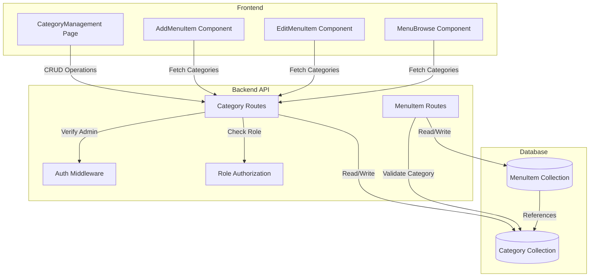
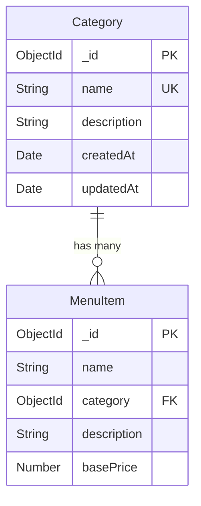

# Design Document: Dynamic Category Management

## Overview

This design document outlines the implementation of dynamic category management for the restaurant menu system. The feature transforms the current hardcoded category system into a flexible, database-driven solution that allows super administrators to create, edit, and delete menu categories.

### Current State

The system currently uses hardcoded categories defined in multiple locations:
- **Backend**: MenuItem model has an enum constraint: `['Main Course', 'Appetizers', 'Beverages', 'Desserts']`
- **Frontend**: AddMenuItem.jsx, EditMenuItem.jsx, and MenuBrowse.jsx all contain hardcoded category arrays

### Target State

The new system will:
- Store categories as independent database entities
- Provide RESTful API endpoints for category CRUD operations
- Dynamically load categories in frontend components
- Maintain referential integrity between menu items and categories
- Restrict category management to super admin users

### Design Principles

1. **Separation of Concerns**: Categories are independent entities, not embedded in menu items
2. **Data Integrity**: Prevent deletion of categories with associated menu items
3. **Security First**: All category management operations require super admin authorization
4. **Backward Compatibility**: Existing menu items will be migrated seamlessly
5. **User Experience**: Frontend components gracefully handle loading states and errors

## Architecture

### System Components



### Data Flow

**Category Creation Flow:**
1. Super admin submits category form
2. Frontend validates input and sends POST request
3. Backend authenticates user and verifies admin role
4. Backend validates category name uniqueness
5. Backend creates category document
6. Backend returns created category
7. Frontend updates UI with new category

**Menu Item Category Selection Flow:**
1. Component mounts (AddMenuItem/EditMenuItem)
2. Frontend fetches categories from API
3. Backend returns all categories
4. Frontend populates dropdown with categories
5. User selects category
6. Frontend submits menu item with category ID
7. Backend validates category exists
8. Backend saves menu item with category reference

## Components and Interfaces

### Backend Components

#### 1. Category Model

**File**: `server/models/Category.js`

**Schema Definition**:
```javascript
{
  name: {
    type: String,
    required: true,
    unique: true,
    trim: true,
    minlength: 1,
    maxlength: 50
  },
  description: {
    type: String,
    trim: true,
    maxlength: 200,
    default: ''
  },
  createdAt: {
    type: Date,
    default: Date.now
  },
  updatedAt: {
    type: Date,
    default: Date.now
  }
}
```

**Indexes**:
- `name`: Unique index for fast lookups and duplicate prevention
- `createdAt`: Index for sorting

**Methods**:
- `getMenuItemCount()`: Returns count of menu items in this category

#### 2. Updated MenuItem Model

**File**: `server/models/MenuItem.js`

**Changes**:
```javascript
// OLD:
category: {
  type: String,
  enum: ['Main Course', 'Appetizers', 'Beverages', 'Desserts'],
  required: true,
}

// NEW:
category: {
  type: mongoose.Schema.Types.ObjectId,
  ref: 'Category',
  required: true,
}
```

**Population**: When retrieving menu items, populate category with `name` and `description` fields

#### 3. Category Routes

**File**: `server/routes/categories.js`

**Endpoints**:

| Method | Path | Auth | Description |
|--------|------|------|-------------|
| GET | `/api/categories` | Any authenticated user | List all categories |
| GET | `/api/categories/:id` | Any authenticated user | Get single category |
| POST | `/api/categories` | Admin only | Create new category |
| PUT | `/api/categories/:id` | Admin only | Update category |
| DELETE | `/api/categories/:id` | Admin only | Delete category |
| GET | `/api/categories/:id/menu-items-count` | Any authenticated user | Get count of menu items in category |

**Request/Response Formats**:

**POST /api/categories**
```javascript
// Request
{
  "name": "Salads",
  "description": "Fresh and healthy salad options"
}

// Response (201 Created)
{
  "_id": "507f1f77bcf86cd799439011",
  "name": "Salads",
  "description": "Fresh and healthy salad options",
  "createdAt": "2024-01-15T10:30:00.000Z",
  "updatedAt": "2024-01-15T10:30:00.000Z"
}

// Error Response (400 Bad Request)
{
  "message": "Category with this name already exists"
}
```

**GET /api/categories**
```javascript
// Response (200 OK)
[
  {
    "_id": "507f1f77bcf86cd799439011",
    "name": "Appetizers",
    "description": "Start your meal right",
    "menuItemCount": 12,
    "createdAt": "2024-01-15T10:30:00.000Z",
    "updatedAt": "2024-01-15T10:30:00.000Z"
  },
  {
    "_id": "507f1f77bcf86cd799439012",
    "name": "Beverages",
    "description": "Refreshing drinks",
    "menuItemCount": 8,
    "createdAt": "2024-01-15T10:30:00.000Z",
    "updatedAt": "2024-01-15T10:30:00.000Z"
  }
]
```

**DELETE /api/categories/:id**
```javascript
// Success Response (200 OK)
{
  "message": "Category deleted successfully"
}

// Error Response (400 Bad Request)
{
  "message": "Cannot delete category with 12 associated menu items",
  "menuItemCount": 12
}

// Error Response (404 Not Found)
{
  "message": "Category not found"
}
```

#### 4. Updated MenuItem Routes

**File**: `server/routes/menuItems.js`

**Changes**:
- Add category validation middleware
- Populate category details in GET requests
- Update query filters to work with ObjectId references

**Category Validation Middleware**:
```javascript
async function validateCategory(req, res, next) {
  if (req.body.category) {
    const category = await Category.findById(req.body.category);
    if (!category) {
      return res.status(400).json({ 
        message: 'Invalid category ID' 
      });
    }
  }
  next();
}
```

#### 5. Migration Script

**File**: `server/scripts/migrateCategories.js`

**Purpose**: One-time script to migrate existing menu items to the new category system

**Steps**:
1. Create Category documents for existing hardcoded categories
2. Create mapping: `{ 'Main Course': categoryId1, 'Appetizers': categoryId2, ... }`
3. Update all MenuItem documents to reference category IDs
4. Verify all menu items have valid category references
5. Log migration results

**Execution**: Run manually via `node server/scripts/migrateCategories.js`

### Frontend Components

#### 1. CategoryManagement Page

**File**: `myapp/src/pages/CategoryManagement.jsx`

**Purpose**: Admin interface for managing categories

**Features**:
- List all categories with name, description, and menu item count
- Create new category button (opens modal)
- Edit category button for each row (opens modal)
- Delete category button with confirmation dialog
- Search/filter categories by name
- Responsive table layout

**State Management**:
```javascript
{
  categories: [],
  loading: false,
  error: null,
  showCreateModal: false,
  showEditModal: false,
  selectedCategory: null,
  showDeleteDialog: false,
  deleteTarget: null
}
```

**API Calls**:
- `fetchCategories()`: GET /api/categories
- `createCategory(data)`: POST /api/categories
- `updateCategory(id, data)`: PUT /api/categories/:id
- `deleteCategory(id)`: DELETE /api/categories/:id

#### 2. CategoryForm Component

**File**: `myapp/src/components/CategoryForm.jsx`

**Purpose**: Reusable form for creating/editing categories

**Props**:
```javascript
{
  initialData: { name: '', description: '' },
  onSubmit: (data) => {},
  onCancel: () => {},
  isEdit: false,
  loading: false
}
```

**Validation**:
- Name: Required, 1-50 characters, no leading/trailing whitespace
- Description: Optional, max 200 characters

#### 3. Updated AddMenuItem Component

**File**: `myapp/src/pages/AddMenuItem.jsx`

**Changes**:
```javascript
// OLD:
const categories = ['Main Course', 'Appetizers', 'Beverages', 'Desserts'];

// NEW:
const [categories, setCategories] = useState([]);
const [categoriesLoading, setCategoriesLoading] = useState(true);

useEffect(() => {
  const fetchCategories = async () => {
    try {
      setCategoriesLoading(true);
      const response = await api.get('/categories');
      setCategories(response.data);
    } catch (error) {
      console.error('Error fetching categories:', error);
      setError('Failed to load categories');
    } finally {
      setCategoriesLoading(false);
    }
  };
  fetchCategories();
}, []);

// Update Select component to use category IDs
<Select
  label="Category"
  value={formData.category}
  onChange={(e) => handleInputChange('category', e.target.value)}
  options={categories.map(cat => ({ 
    value: cat._id, 
    label: cat.name 
  }))}
  disabled={categoriesLoading}
/>
```

#### 4. Updated EditMenuItem Component

**File**: `myapp/src/pages/EditMenuItem.jsx`

**Changes**: Same as AddMenuItem - fetch categories dynamically and use category IDs

#### 5. Updated MenuBrowse Component

**File**: `myapp/src/pages/MenuBrowse.jsx`

**Changes**:
```javascript
// OLD:
const categories = ['All', 'Main Course', 'Appetizers', 'Beverages', 'Desserts'];

// NEW:
const [categories, setCategories] = useState([]);

useEffect(() => {
  const fetchCategories = async () => {
    try {
      const response = await api.get('/categories');
      setCategories([{ _id: 'all', name: 'All' }, ...response.data]);
    } catch (error) {
      console.error('Error fetching categories:', error);
    }
  };
  fetchCategories();
}, []);

// Update filter to use category IDs
<Select
  value={selectedCategory}
  onChange={(e) => setSelectedCategory(e.target.value)}
  options={categories.map(cat => ({
    value: cat._id === 'all' ? 'All' : cat._id,
    label: cat.name
  }))}
/>
```

#### 6. Navigation Updates

**File**: `myapp/src/components/Layout/Sidebar.jsx` (or equivalent)

**Changes**: Add "Category Management" menu item for admin users

```javascript
{user.role === 'Admin' && (
  <NavLink to="/categories">
    <span className="material-icons-outlined">category</span>
    Category Management
  </NavLink>
)}
```

### API Client Updates

**File**: `myapp/src/utils/api.js`

No changes needed - existing axios instance handles all requests

## Data Models

### Category Collection

**Collection Name**: `categories`

**Document Structure**:
```javascript
{
  _id: ObjectId("507f1f77bcf86cd799439011"),
  name: "Appetizers",
  description: "Start your meal with our delicious appetizers",
  createdAt: ISODate("2024-01-15T10:30:00.000Z"),
  updatedAt: ISODate("2024-01-15T10:30:00.000Z")
}
```

**Constraints**:
- `name` must be unique (enforced by unique index)
- `name` cannot be empty or only whitespace
- `name` maximum length: 50 characters
- `description` maximum length: 200 characters

**Indexes**:
```javascript
{ name: 1 }  // Unique index
{ createdAt: -1 }  // For sorting
```

### Updated MenuItem Collection

**Collection Name**: `menuitems`

**Updated Fields**:
```javascript
{
  _id: ObjectId("507f1f77bcf86cd799439013"),
  name: "Caesar Salad",
  category: ObjectId("507f1f77bcf86cd799439011"),  // Changed from String to ObjectId
  description: "Fresh romaine lettuce with caesar dressing",
  // ... other fields remain unchanged
}
```

**Population Example**:
```javascript
// When querying menu items
MenuItem.find().populate('category', 'name description')

// Result:
{
  _id: ObjectId("507f1f77bcf86cd799439013"),
  name: "Caesar Salad",
  category: {
    _id: ObjectId("507f1f77bcf86cd799439011"),
    name: "Appetizers",
    description: "Start your meal with our delicious appetizers"
  },
  // ... other fields
}
```

### Relationships



**Referential Integrity Rules**:
1. A MenuItem MUST reference a valid Category
2. A Category CANNOT be deleted if any MenuItem references it
3. When fetching MenuItems, Category details are populated
4. Category updates automatically reflect in all associated MenuItems (via reference)


## Correctness Properties

*A property is a characteristic or behavior that should hold true across all valid executions of a system—essentially, a formal statement about what the system should do. Properties serve as the bridge between human-readable specifications and machine-verifiable correctness guarantees.*

### Backend API Properties

**Property 1: Category name uniqueness**
*For any* two categories in the system, their names must be unique (case-insensitive comparison). When attempting to create or update a category with a name that already exists, the system should reject the operation with an appropriate error message.
**Validates: Requirements 1.2, 2.2, 4.2**

**Property 2: Category creation with valid data**
*For any* valid category name (non-empty, 1-50 characters) submitted by a super admin, the system should successfully create a category and return it with a unique identifier, timestamps, and the provided name and optional description.
**Validates: Requirements 1.4, 1.5, 2.1, 2.4**

**Property 3: Empty name rejection**
*For any* string composed entirely of whitespace or empty string, attempting to create or update a category with that name should be rejected with a validation error.
**Validates: Requirements 2.3**

**Property 4: Optional description field**
*For any* category creation or update request, the description field should be optional - categories can be created with or without descriptions, and both should succeed.
**Validates: Requirements 1.3**

**Property 5: Authorization enforcement for category management**
*For any* category management operation (create, update, delete), when the request is made by a user without the "Admin" role, the system should reject the request with a 403 Forbidden status code. When the request lacks authentication credentials, the system should return a 401 Unauthorized status code.
**Validates: Requirements 2.5, 4.4, 5.4, 11.1, 11.2, 11.3**

**Property 6: Category list retrieval and ordering**
*For any* set of categories in the system, when an authenticated user requests the category list, the system should return all categories ordered alphabetically by name, with each category including its identifier, name, description, and menu item count.
**Validates: Requirements 3.1, 3.2**

**Property 7: Category update with valid data**
*For any* existing category and valid new name, when a super admin updates the category, the system should update the category name and/or description, update the modification timestamp, and return the updated category.
**Validates: Requirements 4.1, 4.3**

**Property 8: Invalid category ID error handling**
*For any* invalid or non-existent category identifier, when attempting to update or delete that category, the system should return a 404 Not Found error.
**Validates: Requirements 4.5, 5.5**

**Property 9: Category deletion without menu items**
*For any* category that has no associated menu items, when a super admin attempts to delete it, the system should successfully delete the category and return a success confirmation.
**Validates: Requirements 5.1, 5.3**

**Property 10: Category deletion prevention with menu items**
*For any* category that has one or more associated menu items, when a super admin attempts to delete it, the system should reject the deletion and return an error message indicating the number of affected menu items.
**Validates: Requirements 5.2**

**Property 11: Menu item category validation**
*For any* menu item creation or update request, the system should validate that the specified category identifier exists. If the category ID is invalid, the request should be rejected with an error message.
**Validates: Requirements 6.1, 6.2**

**Property 12: Menu item category population**
*For any* menu item retrieval operation, the system should populate the category field with the category's name and description (not just the ID reference).
**Validates: Requirements 6.3**

**Property 13: Input sanitization**
*For any* category name or description containing potentially malicious content (HTML tags, script tags, SQL injection attempts), the system should sanitize the input before storage, removing or escaping dangerous characters.
**Validates: Requirements 11.5**

### Frontend Component Properties

**Property 14: Component category loading**
*For any* of the menu-related components (AddMenuItem, EditMenuItem, MenuBrowse), when the component mounts, it should fetch the current category list from the API and populate the category selector.
**Validates: Requirements 7.1, 7.2, 8.1**

**Property 15: Category dropdown display**
*For any* set of categories loaded from the API, the frontend components should display them in a dropdown selector with the category name as the label and category ID as the value.
**Validates: Requirements 7.3**

**Property 16: Category loading error handling**
*For any* API failure when loading categories, the frontend components should display an error message and provide a retry option to the user.
**Validates: Requirements 7.4**

**Property 17: Category filtering behavior**
*For any* category selected in the MenuBrowse filter, the component should display only menu items that belong to that category. When "All" is selected, all menu items should be displayed regardless of category.
**Validates: Requirements 8.2, 8.3**

**Property 18: Category menu item count display**
*For any* category in the filter dropdown, the component should display the count of menu items in that category.
**Validates: Requirements 8.4**

**Property 19: Category management page display**
*For any* super admin user navigating to the category management page, the page should display a list of all categories with their names, descriptions, and menu item counts.
**Validates: Requirements 9.1**

**Property 20: Category management UI interactions**
*For any* category management action (create, edit, delete), when a super admin clicks the corresponding button, the appropriate UI element should appear (create form, edit form with pre-filled data, or delete confirmation dialog).
**Validates: Requirements 9.2, 9.3, 9.4**

**Property 21: Delete warning for categories with menu items**
*For any* category with associated menu items, when a super admin attempts to delete it, the confirmation dialog should display a warning showing the number of affected menu items.
**Validates: Requirements 9.5**

**Property 22: Frontend authorization enforcement**
*For any* non-super-admin user attempting to access the category management page, the frontend should either redirect to an unauthorized page or hide the category management options from the navigation.
**Validates: Requirements 9.6**

### Migration Properties

**Property 23: Migration creates default categories**
When the migration script runs, it should create exactly four category records corresponding to the existing hardcoded categories: "Main Course", "Appetizers", "Beverages", and "Desserts".
**Validates: Requirements 10.1**

**Property 24: Migration updates menu items**
*For any* existing menu item with a hardcoded category string, the migration should update its category field to reference the corresponding new category identifier, and all menu items should have valid category references after migration completes.
**Validates: Requirements 10.2, 10.3**

**Property 25: Migration logging**
When the migration script runs, it should log the migration process including the number of categories created, menu items updated, and any errors encountered.
**Validates: Requirements 10.4**

## Error Handling

### Backend Error Scenarios

| Scenario | HTTP Status | Error Response | Handling |
|----------|-------------|----------------|----------|
| Duplicate category name | 400 Bad Request | `{ message: "Category with this name already exists" }` | Check uniqueness before insert/update |
| Empty category name | 400 Bad Request | `{ message: "Category name is required" }` | Validate input before processing |
| Invalid category ID | 404 Not Found | `{ message: "Category not found" }` | Verify category exists before operations |
| Delete category with menu items | 400 Bad Request | `{ message: "Cannot delete category with X menu items", menuItemCount: X }` | Count menu items before deletion |
| Unauthorized access | 401 Unauthorized | `{ message: "Authentication required" }` | Verify JWT token exists and is valid |
| Insufficient permissions | 403 Forbidden | `{ message: "Access denied. Admin role required" }` | Check user role is "Admin" |
| Invalid menu item category | 400 Bad Request | `{ message: "Invalid category ID" }` | Validate category exists when creating/updating menu items |
| Database connection error | 500 Internal Server Error | `{ message: "Database error" }` | Log error, return generic message |
| Validation error | 400 Bad Request | `{ message: "Validation failed", errors: [...] }` | Return specific validation errors |

### Frontend Error Scenarios

| Scenario | User Experience | Recovery Action |
|----------|----------------|-----------------|
| Category fetch fails | Display error banner: "Failed to load categories" | Show "Retry" button to refetch |
| Category create fails | Display error message in form | Allow user to correct and resubmit |
| Category update fails | Display error message in modal | Keep modal open for correction |
| Category delete fails | Display error in confirmation dialog | Show reason (e.g., "has 12 menu items") |
| Network timeout | Display "Connection timeout" message | Provide retry option |
| Unauthorized access | Redirect to login or show "Access Denied" | Redirect to appropriate page |
| Empty category list | Display "No categories available" message | Show "Create Category" button for admins |

### Error Recovery Strategies

1. **Optimistic UI Updates**: Update UI immediately, rollback on error
2. **Retry Logic**: Implement exponential backoff for transient failures
3. **Graceful Degradation**: If categories fail to load, show cached data or allow manual entry
4. **User Feedback**: Always inform users of errors with clear, actionable messages
5. **Logging**: Log all errors server-side for debugging and monitoring

## Testing Strategy

### Dual Testing Approach

This feature requires both unit testing and property-based testing for comprehensive coverage:

- **Unit tests**: Verify specific examples, edge cases, and error conditions
- **Property tests**: Verify universal properties across all inputs
- Both approaches are complementary and necessary

### Property-Based Testing

**Library Selection**: 
- Backend (Node.js): Use `fast-check` library for property-based testing
- Frontend (React): Use `@fast-check/jest` for component property testing

**Configuration**:
- Minimum 100 iterations per property test
- Each test must reference its design document property
- Tag format: `Feature: category-management, Property {number}: {property_text}`

**Example Property Test Structure**:
```javascript
// Backend example
import fc from 'fast-check';

describe('Feature: category-management, Property 1: Category name uniqueness', () => {
  it('should reject duplicate category names', async () => {
    await fc.assert(
      fc.asyncProperty(
        fc.string({ minLength: 1, maxLength: 50 }),
        async (categoryName) => {
          // Create first category
          const category1 = await Category.create({ name: categoryName });
          
          // Attempt to create duplicate
          await expect(
            Category.create({ name: categoryName })
          ).rejects.toThrow();
          
          // Cleanup
          await Category.deleteOne({ _id: category1._id });
        }
      ),
      { numRuns: 100 }
    );
  });
});
```

### Unit Testing

**Backend Unit Tests** (`server/tests/`):
- Category model validation
- Category route handlers
- Authorization middleware
- Migration script
- Error handling

**Frontend Unit Tests** (`myapp/src/tests/`):
- CategoryManagement component rendering
- CategoryForm validation
- API integration
- Error state handling
- Loading states

**Integration Tests**:
- End-to-end category CRUD operations
- Menu item category reference validation
- Authorization flow
- Migration process

### Test Coverage Goals

- **Backend**: 90%+ code coverage
- **Frontend**: 80%+ code coverage
- **Property Tests**: All 25 properties implemented
- **Edge Cases**: Empty states, boundary values, error conditions

### Testing Checklist

**Backend**:
- [ ] Category model creates documents correctly
- [ ] Unique name constraint enforced
- [ ] Authorization middleware blocks non-admins
- [ ] Category routes handle all CRUD operations
- [ ] Menu item validation checks category existence
- [ ] Migration script creates default categories
- [ ] Migration script updates existing menu items
- [ ] Error responses match specification

**Frontend**:
- [ ] CategoryManagement page renders for admins
- [ ] CategoryManagement page blocks non-admins
- [ ] Category form validates input
- [ ] AddMenuItem loads categories dynamically
- [ ] EditMenuItem loads categories dynamically
- [ ] MenuBrowse filters by category
- [ ] Error states display correctly
- [ ] Loading states display correctly

**Integration**:
- [ ] Create category → appears in menu item dropdowns
- [ ] Update category → changes reflect in menu items
- [ ] Delete category with menu items → blocked
- [ ] Delete category without menu items → succeeds
- [ ] Non-admin access → properly rejected
- [ ] Migration → all menu items have valid categories
