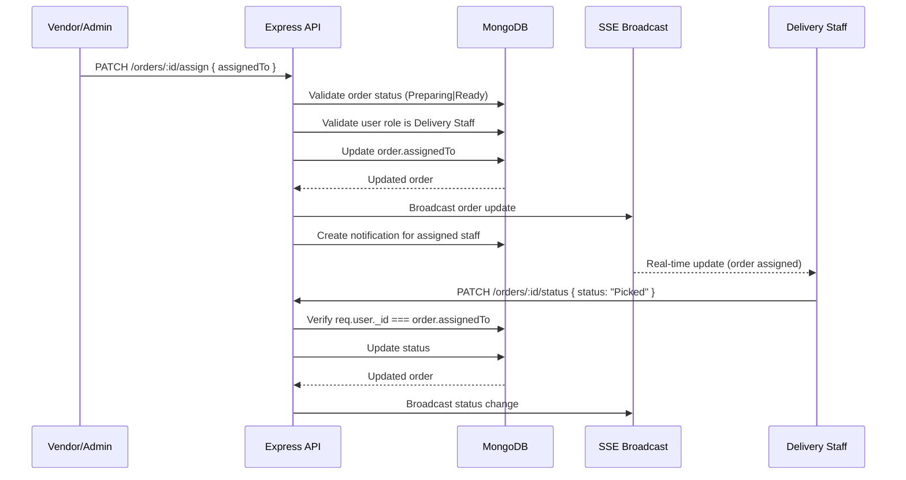

# Design Document: Delivery Staff Assignment

## Overview

Manual delivery staff assignment feature allowing Vendor/Admin users to assign a specific delivery person to an order when it reaches "Preparing" or "Ready" status. Once assigned, only the designated delivery staff can progress the order through Picked → In Transit → Delivered.

## Main Algorithm/Workflow



## Core Interfaces/Types

```javascript
// Order model addition (server/models/Order.js)
const orderSchema = new mongoose.Schema({
  // ... existing fields ...
  assignedTo: {
    type: mongoose.Schema.Types.ObjectId,
    ref: 'User',
    default: null,
  },
});

// API request/response shapes
const AssignRequest = {
  assignedTo: 'ObjectId (User._id with role Delivery Staff)',
};

const AssignResponse = {
  // Full populated order object with assignedTo populated
  _id: 'ObjectId',
  orderId: 'String',
  assignedTo: { _id: 'ObjectId', name: 'String', phone: 'String' },
  status: 'String',
  // ... rest of order fields
};
```

## Key Functions with Formal Specifications

### Function 1: assignDeliveryStaff (Route Handler)

```javascript
// PATCH /orders/:id/assign
async function assignDeliveryStaff(req, res) {
  const { id } = req.params;
  const { assignedTo } = req.body;
  // ... implementation
}
```

**Preconditions:**
- `req.user` is authenticated with role `Vendor`, `Admin`, or `Company Admin`
- `req.params.id` is a valid MongoDB ObjectId referencing an existing order
- `req.body.assignedTo` is a valid MongoDB ObjectId referencing a User with role `Delivery Staff` and status `Active`
- Order status is `Preparing` or `Ready`

**Postconditions:**
- `order.assignedTo` is set to the provided user ID
- SSE broadcast sent to all connected clients with updated order
- Notification created for the assigned delivery staff user
- Returns populated order with `assignedTo` field populated (name, phone)

**Loop Invariants:** N/A

### Function 2: enforceAssignment (Status Update Guard)

```javascript
// Modification to existing PATCH /orders/:id/status handler
function enforceAssignment(order, req) {
  const deliveryStatuses = ['Picked', 'In Transit', 'Delivered'];
  if (deliveryStatuses.includes(req.body.status)) {
    if (order.assignedTo && order.assignedTo.toString() !== req.user._id.toString()) {
      throw new ForbiddenError('Only the assigned delivery staff can update this order');
    }
  }
}
```

**Preconditions:**
- `order` is a valid order document fetched from DB
- `req.user` is authenticated with role `Delivery Staff`
- `req.body.status` is one of `Picked`, `In Transit`, `Delivered`

**Postconditions:**
- If `order.assignedTo` exists and does not match `req.user._id`, returns 403
- If `order.assignedTo` is null (unassigned), any delivery staff can proceed (backward compatible)
- If `order.assignedTo` matches `req.user._id`, status update proceeds normally

**Loop Invariants:** N/A

### Function 3: fetchDeliveryStaffList (API Endpoint)

```javascript
// GET /users?role=Delivery Staff&status=Active
// Already exists via user management — used by frontend dropdown
async function fetchDeliveryStaff(req, res) {
  const staff = await User.find({ role: 'Delivery Staff', status: 'Active' })
    .select('_id name phone');
  return staff;
}
```

**Preconditions:**
- `req.user` is authenticated with role `Vendor`, `Admin`, or `Company Admin`

**Postconditions:**
- Returns array of active delivery staff users (id, name, phone only)

**Loop Invariants:** N/A

### Function 4: filterAssignedOrders (DeliveryDashboard)

```javascript
// Frontend: filter orders to show only those assigned to logged-in delivery staff
function filterAssignedOrders(orders, userId) {
  return orders.filter(order =>
    order.assignedTo?._id === userId || order.assignedTo === userId
  );
}
```

**Preconditions:**
- `orders` is an array of order objects (may have `assignedTo` populated or as raw ID)
- `userId` is the logged-in delivery staff user's `_id`

**Postconditions:**
- Returns only orders where `assignedTo` matches the current user
- Unassigned orders (assignedTo === null) are excluded from delivery staff view

**Loop Invariants:** N/A

## Algorithmic Pseudocode

### Assignment Endpoint Algorithm

```javascript
// PATCH /orders/:id/assign
router.patch('/:id/assign', authenticate, async (req, res) => {
  // Step 1: Authorization check
  const allowedRoles = ['Vendor', 'Admin', 'Company Admin'];
  if (!allowedRoles.includes(req.user.role)) {
    return res.status(403).json({ message: 'Only Vendor/Admin can assign delivery staff' });
  }

  // Step 2: Validate assignedTo user exists and is delivery staff
  const { assignedTo } = req.body;
  if (!assignedTo) {
    return res.status(400).json({ message: 'assignedTo is required' });
  }

  const deliveryUser = await User.findById(assignedTo);
  if (!deliveryUser || deliveryUser.role !== 'Delivery Staff') {
    return res.status(400).json({ message: 'Invalid delivery staff user' });
  }
  if (deliveryUser.status !== 'Active') {
    return res.status(400).json({ message: 'Delivery staff is not active' });
  }

  // Step 3: Validate order exists and is in assignable status
  const order = await Order.findById(req.params.id);
  if (!order) {
    return res.status(404).json({ message: 'Order not found' });
  }
  if (!['Preparing', 'Ready'].includes(order.status)) {
    return res.status(400).json({ message: 'Order can only be assigned when Preparing or Ready' });
  }

  // Step 4: Assign and save
  order.assignedTo = assignedTo;
  await order.save();

  // Step 5: Populate and return
  const populatedOrder = await Order.findById(order._id)
    .populate('vendor', 'name outletId')
    .populate('items.menuItem', 'name image basePrice')
    .populate('assignedTo', 'name phone');

  // Step 6: Broadcast via SSE
  broadcastOrderUpdate(populatedOrder);

  // Step 7: Notify assigned delivery staff
  await Notification.create({
    user: assignedTo,
    title: 'New Delivery Assignment',
    message: `You have been assigned to deliver order ${order.orderId}.`,
    type: 'delivery',
    relatedId: order._id,
    relatedModel: 'Order',
  });

  return res.json(populatedOrder);
});
```

### Modified Status Update Guard

```javascript
// Inside existing PATCH /orders/:id/status handler, add before status update:
const deliveryStatuses = ['Picked', 'In Transit', 'Delivered'];
if (role === 'Delivery Staff' && deliveryStatuses.includes(status)) {
  const order = await Order.findById(req.params.id);
  if (order.assignedTo && order.assignedTo.toString() !== req.user._id.toString()) {
    return res.status(403).json({ message: 'This order is assigned to another delivery staff' });
  }
}
```

### DeliveryDashboard Filter (Frontend)

```javascript
// In DeliveryDashboard.jsx fetchOrders:
const response = await api.get('/orders', { params });
const deliveryOrders = response.data.filter(order => {
  if (order.deliveryMode !== 'Delivery') return false;
  // Only show orders assigned to this delivery staff
  const assignedId = order.assignedTo?._id || order.assignedTo;
  return assignedId === user._id;
});
```

### OrderManagement Assignment UI

```javascript
// In OrderManagement.jsx — new "Assign Delivery" dropdown for Ready/Preparing orders
{(isVendor || isAdmin) && ['Preparing', 'Ready'].includes(order.status) && order.deliveryMode === 'Delivery' && (
  <select
    className="text-xs border border-slate-200 dark:border-slate-700 rounded-lg px-2 py-1"
    value={order.assignedTo?._id || ''}
    onChange={(e) => handleAssignDelivery(order._id, e.target.value)}
  >
    <option value="">Assign Delivery</option>
    {deliveryStaff.map(staff => (
      <option key={staff._id} value={staff._id}>{staff.name}</option>
    ))}
  </select>
)}
```

### OrderTracking — Show Assigned Staff

```javascript
// In OrderTracking.jsx Delivery Information card:
{order.assignedTo && (
  <div>
    <p className="text-sm text-slate-500">Delivery Person</p>
    <p className="font-medium">{order.assignedTo.name}</p>
    {order.assignedTo.phone && (
      <p className="text-sm text-slate-500">{order.assignedTo.phone}</p>
    )}
  </div>
)}
```

## Example Usage

```javascript
// Example 1: Vendor assigns delivery staff to a ready order
const response = await api.patch(`/orders/${orderId}/assign`, {
  assignedTo: '665abc123def456ghi789jkl'  // Delivery Staff user ID
});
// response.data => { ...order, assignedTo: { _id: '...', name: 'Ravi Kumar', phone: '9876543210' } }

// Example 2: Assigned delivery staff picks up order (succeeds)
await api.patch(`/orders/${orderId}/status`, { status: 'Picked' });
// 200 OK — user matches order.assignedTo

// Example 3: Unassigned delivery staff tries to pick up (fails)
await api.patch(`/orders/${orderId}/status`, { status: 'Picked' });
// 403 — "This order is assigned to another delivery staff"

// Example 4: Reassignment — vendor changes assigned staff
await api.patch(`/orders/${orderId}/assign`, {
  assignedTo: 'newDeliveryStaffId'
});
// Previous assignment overwritten, new notification sent

// Example 5: Unassign — vendor removes assignment (optional)
await api.patch(`/orders/${orderId}/assign`, {
  assignedTo: null
});
// Falls back to "any delivery staff can pick up" behavior
```

## Correctness Properties

*A property is a characteristic or behavior that should hold true across all valid executions of a system — essentially, a formal statement about what the system should do. Properties serve as the bridge between human-readable specifications and machine-verifiable correctness guarantees.*

### Property 1: Valid assignment persists correctly

*For any* order in Assignable_Status and any active Delivery_Staff user, when a Vendor/Admin/Company Admin assigns that staff to the order, the order's `assignedTo` field should equal the assigned user's ID, and reassigning to a different staff should overwrite the previous value.

**Validates: Requirements 1.1, 1.5**

### Property 2: Role authorization enforcement

*For any* user whose role is not Vendor, Admin, or Company Admin, attempting to assign delivery staff to any order should result in a 403 rejection.

**Validates: Requirement 1.2**

### Property 3: Invalid delivery staff rejection

*For any* user ID that does not reference an active user with role "Delivery Staff", attempting to assign that ID to an order should result in a 400 rejection.

**Validates: Requirement 1.3**

### Property 4: Order status precondition enforcement

*For any* order whose status is not "Preparing" or "Ready", attempting to assign delivery staff should result in a 400 rejection.

**Validates: Requirement 1.4**

### Property 5: Assigned order locked to assigned staff

*For any* order with a non-null `assignedTo` and any Delivery_Staff user whose ID does not match `assignedTo`, attempting to update the order status to Picked, In Transit, or Delivered should result in a 403 rejection.

**Validates: Requirement 2.1**

### Property 6: Unassigned orders remain open to any delivery staff

*For any* order with a null `assignedTo` field and any active Delivery_Staff user, that user should be able to update the order to any Delivery_Status without restriction.

**Validates: Requirements 2.2, 9.1**

### Property 7: Admin bypasses assignment guard

*For any* order (regardless of `assignedTo` value) and any Admin or Company Admin user, status updates to Delivery_Status values should succeed without assignment checks.

**Validates: Requirement 2.3**

### Property 8: Notification created on assignment

*For any* successful delivery staff assignment (including reassignment), a notification should exist for the assigned user with type "delivery" and a message referencing the order ID.

**Validates: Requirements 4.1, 4.2**

### Property 9: SSE broadcast on assignment

*For any* successful delivery staff assignment, the SSE broadcaster should emit an `order_update` event containing the updated order with populated `assignedTo` details.

**Validates: Requirements 5.1, 5.2**

### Property 10: Delivery dashboard shows only assigned orders

*For any* Delivery_Staff user and any set of orders, the DeliveryDashboard should display exactly those orders where `assignedTo` matches the logged-in user's ID, and no others.

**Validates: Requirement 7.1**

### Property 11: Order tracking displays assigned staff info

*For any* order with a populated `assignedTo`, the OrderTracking page should display the delivery person's name. For any order without `assignedTo`, no delivery person information should be displayed.

**Validates: Requirements 8.1, 8.2, 8.3**

### Property 12: Non-delivery orders unaffected by assignment logic

*For any* order with deliveryMode "Pickup" or "Dine-in", the assignment guard should not interfere with status updates regardless of the `assignedTo` field value.

**Validates: Requirement 9.3**

### Property 13: Assignment dropdown visibility

*For any* delivery order in Assignable_Status viewed by a Vendor/Admin, the assignment dropdown should be visible and populated with active delivery staff. For any non-delivery order or order not in Assignable_Status, the dropdown should not appear.

**Validates: Requirements 6.1, 6.4**
